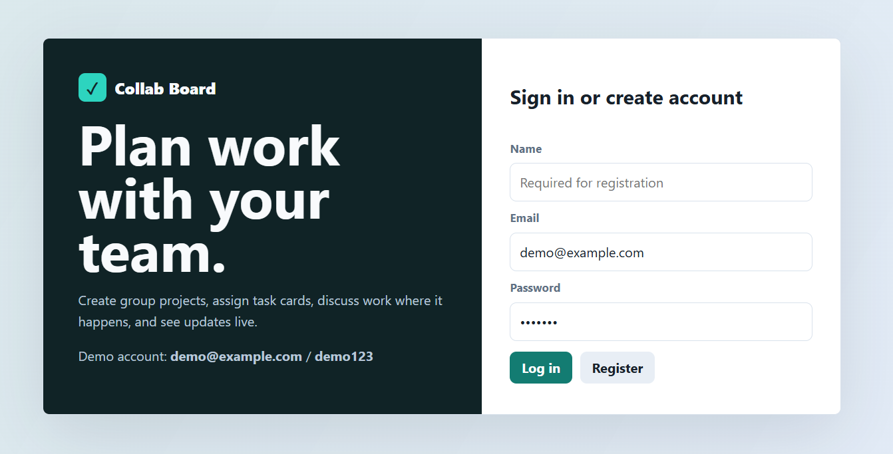
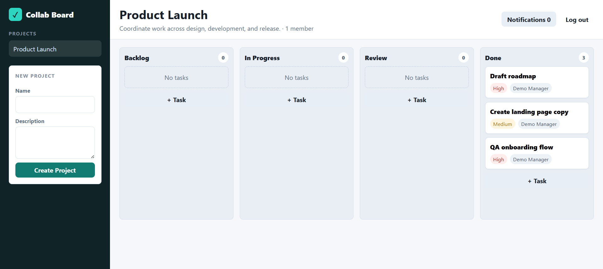

# Collab Board

Collab Board is a full-stack project management app for planning team work. It lets users create projects, organize task boards, assign work, and discuss tasks in one place.

The app is inspired by tools like Trello and Asana, with a simple kanban-style board and realtime updates.

## Screenshots

### Login Page



### Project Board



## Features

- User registration and login
- Demo account for quick testing
- Group project creation
- Project board with task columns
- Task cards with title, status, priority, due date, and assignee
- Task comments for communication
- Notifications for project activity
- Realtime updates using WebSockets
- Local JSON storage, so no database setup is needed

## Tech Stack

- Node.js
- HTML
- CSS
- JavaScript
- WebSockets
- JSON file storage

## Project Structure

```text
.
├── assets
│   ├── board-screen.png
│   └── login-screen.png
├── public
│   ├── app.js
│   ├── index.html
│   └── styles.css
├── package.json
├── README.md
└── server.js
```

## Run Locally

Make sure Node.js is installed on your computer.

Clone this repository:

```bash
git clone YOUR_REPOSITORY_URL
```

Go into the project folder:

```bash
cd YOUR_REPOSITORY_FOLDER
```

Start the app:

```bash
node server.js
```

Open the app in your browser:

```text
http://localhost:3000
```

## Demo Login

The app automatically creates a demo account the first time it runs.

```text
Email: demo@example.com
Password: demo123
```

You can also create a new account from the register button on the login page.

## Local Data

When you run the app, it automatically creates this file:

```text
data/db.json
```

That file stores users, projects, boards, tasks, comments, and notifications for local testing.

## Notes

- No external database is required for local use.
- No separate frontend setup is required.
- The frontend is stored in the `public` folder.
- The backend and frontend run together from `server.js`.
